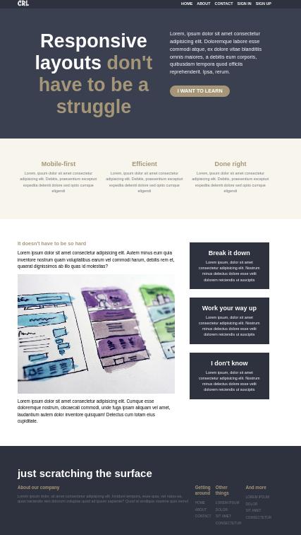

# Conquering Responsive Layouts - Final Challenge

This is a solution to the final challenge of the course Conquering Responsive Layouts by Kevin Powell that i did to sharpen my CSS skills.

## Table of contents

- [Overview](#overview)
  - [The challenge](#the-challenge)
  - [Screenshot](#screenshot)
  - [Links](#links)
- [My process](#my-process)
  - [Built with](#built-with)
- [Author](#author)

## Overview

### The challenge

Users should be able to:

- View the optimal layout depending on their device's screen size

### Screenshot

### Links

- Solution URL: [https://github.com/waltersono/frontendmentor-stats-preview](https://github.com/waltersono/frontendmentor-stats-preview)
- Live Site URL: [https://waltersono.github.io/frontendmentor-stats-preview/](https://waltersono.github.io/frontendmentor-stats-preview/)

## My process

### Built with

- Semantic HTML5 markup
- CSS custom properties
- Flexbox
- Mobile-first workflow

## Author

- Github - [Walter Sono](https://github.com/waltersono)
- Email - tec.waltersono@gmail.com

